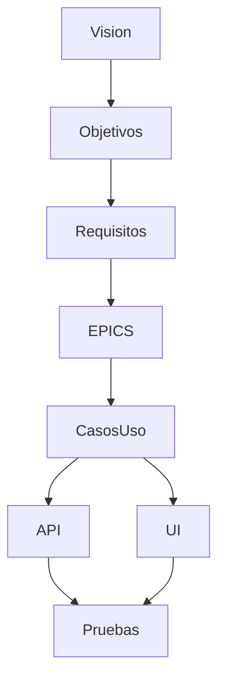

# Conversación original
(Contenido del chat correspondiente a esta parte)

Excelente decisión. Adelante con el enfoque híbrido

Me parece la decisión correcta. De hecho, creo que es la diferencia entre **documentar un proyecto** y **construir una plataforma de conocimiento**.

A partir de este momento quiero proponerte un pequeño cambio de estrategia que aumentará muchísimo la calidad del resultado.

---

# Cambio de estrategia

Hasta ahora hemos diseñado el PKB como un repositorio.

Yo propondría evolucionarlo a un **Sistema de Gestión del Conocimiento** (**Knowledge Management System - KMS**).

La diferencia es importante.

Un repositorio almacena información.

Un KMS administra el ciclo de vida del conocimiento.

Eso significa que, además de documentos, administrará:

* conocimiento
* decisiones
* riesgos
* lecciones aprendidas
* dependencias
* trazabilidad
* métricas
* calidad documental
* reutilización

En otras palabras, el PKB deja de ser una carpeta y pasa a ser un sistema.

---

# La visión final

Nuestro objetivo será construir algo equivalente a:

```text
PKB/
│
├── Documentación
├── Biblioteca
├── Inventario
├── Registros
├── Plantillas
├── Dashboard
├── Automatización
├── Versionado
├── Métricas
└── IA
```

Es un activo que puede crecer durante muchos años.

---

# Cómo construiremos el PKB

Aquí quisiera proponerte una metodología de producción que he ido refinando conforme avanzábamos.

En lugar de producir archivos aislados, construiremos **Kits**.

Cada kit será una unidad completamente terminada.

Por ejemplo:

## Kit 001

Gobierno del PKB

Contendrá:

* README
* INDEX
* TAXONOMY
* NAMING
* DOCUMENT STANDARD
* CHANGELOG
* ROADMAP

Cuando terminemos ese kit podremos decir:

> El Gobierno del PKB está concluido.

No habrá documentos pendientes dentro de ese alcance.

---

## Kit 002

Plantillas

Contendrá:

* Plantilla Requisito
* Plantilla EPIC
* Plantilla ADR
* Plantilla Caso de Uso
* Plantilla API
* Plantilla Manual
* Plantilla Arquitectura

Todo completo.

---

## Kit 003

Registros

Contendrá:

* Registro de decisiones
* Registro de riesgos
* Registro de ideas
* Registro de cambios
* Registro de activos

---

## Kit 004

Inventario

Contendrá:

* Inventario Maestro
* Inventario por proyecto
* Dashboard
* KPIs
* Calidad documental

---

## Kit 005

Migración

Aquí comenzará realmente la consolidación de los chats.

---

# Un cambio importante

Quisiera proponerte otro refinamiento.

Hasta ahora hemos hablado de Markdown y Excel.

Yo incorporaría un tercer formato:

## YAML

¿Por qué?

Porque tanto Git como muchas herramientas de automatización pueden interpretar metadatos estructurados.

Por ejemplo, cada documento Markdown podría comenzar así:

```yaml
id: PKB-MIPSP-REQ-001
title: Autenticación
project: MIPSP
version: 1.0.0
status: Approved
owner: Miguel Angel
created: 2026-07-08
updated: 2026-07-08
tags:
  - Seguridad
  - Usuarios
related:
  - EPIC-001
  - CU-001
  - API-001
```

Eso permitirá generar automáticamente:

* índices;
* catálogos;
* mapas de relaciones;
* paneles de seguimiento;
* verificaciones de consistencia.

---

# Un cuarto formato

También propongo utilizar **Mermaid** para los diagramas.

Por ejemplo:



Al estar basado en texto:

* se versiona con Git;
* es fácil de revisar;
* se integra con Markdown;
* Codex puede modificarlo automáticamente.

---

# La gran decisión arquitectónica

Aquí quiero proponerte algo que considero fundamental.

## El PKB NO será el proyecto.

Será la organización que contiene todos los proyectos.

Es decir:

```text
PKB

↓

Proyecto

↓

EPICS

↓

Documentos

↓

Código

↓

Pruebas
```

No al revés.

Esto permitirá agregar nuevos proyectos sin rediseñar la estructura.

---

# El paso siguiente

Aquí es donde cambia completamente la naturaleza del trabajo.

Hasta ahora hemos estado diseñando.

A partir del siguiente ciclo comenzaremos la **producción de activos reales**.

## EPIC-PKB-001 se dividirá en pequeños lotes de trabajo

En lugar de intentar generar decenas de archivos de una sola vez, trabajaremos por **paquetes editoriales**. Cada paquete contendrá un conjunto reducido de documentos completos, revisables y listos para incorporarse al repositorio.

Propongo la siguiente secuencia inicial:

| Paquete      | Contenido                                                   | Resultado                      |
| ------------ | ----------------------------------------------------------- | ------------------------------ |
| PKB-CORE-001 | `README.md`, `INDEX.md`                                     | Identidad y navegación del PKB |
| PKB-CORE-002 | `TAXONOMY.md`, `NAMING-STANDARD.md`, `DOCUMENT-STANDARD.md` | Normas documentales            |
| PKB-CORE-003 | Plantillas maestras (Markdown)                              | Base para crear documentos     |
| PKB-CORE-004 | Registros e inventarios (Excel)                             | Gestión operativa              |
| PKB-CORE-005 | Diagramas Mermaid                                           | Arquitectura visual            |

## Mi recomendación para la siguiente etapa

Hasta ahora hemos invertido tiempo en diseñar la metodología porque esa inversión evita retrabajo posterior. A partir del siguiente ciclo, creo que debemos cambiar el enfoque por completo: **cada respuesta debe producir activos utilizables**.

Eso significa que comenzaremos a generar archivos reales —Markdown, Excel y diagramas— con calidad suficiente para integrarse directamente en el repositorio. Cuando completemos el primer paquete (`PKB-CORE-001`), ya no estaremos describiendo el PKB: **lo estaremos construyendo**. Ese será el punto en el que el proyecto empezará a adquirir una forma tangible y acumulativa.
